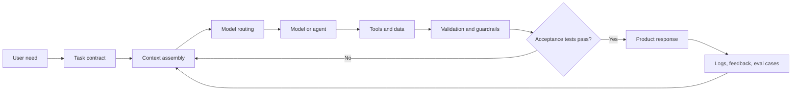

# AI Engineering Handbook

A practical, project-first path from software developer to production AI engineer.

This repository teaches the parts of AI engineering that matter after the demo works: model behavior, context engineering, retrieval, tools, agents, evaluation, observability, safety, cost, latency, and reliable delivery.

It is intentionally vendor-neutral. The runnable examples use the OpenAI Responses API because it provides a compact way to demonstrate current model, structured-output, and tool-calling patterns. The architectural lessons apply to other providers and open-weight models.

## What an AI engineer actually does

An AI engineer builds systems in which probabilistic model behavior is contained by deterministic software:



The core job is not prompt writing. It is designing and improving this entire loop.

## Start here

1. Read the [curriculum map](CURRICULUM.md).
2. Follow the [16-week roadmap](ROADMAP.md), adjusting the pace to your experience.
3. Build every project in [projects/](projects/).
4. Use the [playbooks](playbooks/) during real work.
5. Track evidence with the [skills scorecard](SCORECARD.md).
6. Consult the [primary resource shelf](RESOURCES.md) and [glossary](GLOSSARY.md) as needed.

## Curriculum

| Module | Outcome |
|---|---|
| [1. Engineering foundations](docs/01-engineering-foundations.md) | Build reliable APIs, tests, data flows, and deployments |
| [2. ML foundations](docs/02-ml-foundations.md) | Reason about data, training, generalization, and metrics |
| [3. LLM foundations](docs/03-llm-foundations.md) | Understand tokens, transformers, inference, embeddings, and limitations |
| [4. Prompt and context engineering](docs/04-prompt-context-engineering.md) | Write outcome-first prompts and manage context deliberately |
| [5. Structured outputs and tools](docs/05-structured-outputs-tools.md) | Turn model text into typed, validated software behavior |
| [6. Retrieval and RAG](docs/06-retrieval-rag.md) | Build evidence-grounded retrieval pipelines |
| [7. Agent skills](docs/07-agent-skills.md) and [workflows](docs/07-agents-workflows.md) | Package reusable procedures and choose between code, workflows, and agents |
| [8. Evals and observability](docs/08-evals-observability.md) | Measure quality and debug nondeterministic systems |
| [9. Safety and security](docs/09-safety-security.md) | Defend data, tools, users, and infrastructure |
| [10. Production systems](docs/10-production-systems.md) | Engineer for reliability, latency, scale, and cost |
| [11. Model customization](docs/11-model-customization.md) | Decide when to prompt, retrieve, fine-tune, distill, or self-host |
| [12. Product and career](docs/12-product-career.md) | Select valuable problems and demonstrate professional judgment |

## Portfolio projects

- [Structured support-ticket extractor](projects/01-structured-extractor.md)
- [Evidence-grounded document assistant](projects/02-rag-assistant.md)
- [Tool-using operations agent](projects/03-tool-using-agent.md)
- [Production AI feature capstone](projects/04-production-capstone.md)

Each project includes requirements, evaluation criteria, failure cases, and stretch goals. A polished project with measured behavior is worth more than ten disconnected tutorials.

## Operating principles

1. Start with the user outcome and a measurable success criterion.
2. Use deterministic software before asking a model to reason.
3. Give models the smallest relevant context and tool set.
4. Treat model output as untrusted input until validated.
5. Evaluate the whole system, not the model in isolation.
6. Optimize quality first, then latency and cost without breaking quality.
7. Require human approval at consequential or irreversible boundaries.
8. Turn every meaningful production failure into a regression test.

## Repository map

```text
docs/       Core lessons and exercises
playbooks/  Repeatable operating procedures
templates/  Task, eval, model, and threat-model documents
projects/   Portfolio-grade build specifications
examples/   Small runnable reference implementations
.agents/    A working, portable Agent Skill example
```

## Current OpenAI references

The OpenAI-specific examples follow the current [Responses API guidance](https://developers.openai.com/api/docs/guides/migrate-to-responses), [model guidance](https://developers.openai.com/api/docs/guides/latest-model), and [evaluation guidance](https://developers.openai.com/api/docs/guides/evaluation-best-practices). Provider features, model names, limits, and prices change; verify current documentation before production decisions.

## How to use AI while learning AI

Use an AI coding assistant as a reviewer and simulator, not as a substitute for understanding:

- Ask it to explain tradeoffs and predict failure modes.
- Make your own design choice before reading its recommendation.
- Require tests and inspect every meaningful diff.
- Reimplement important components from a blank file.
- Keep a failure journal: symptom, root cause, fix, and regression test.

## License

[MIT](LICENSE)
