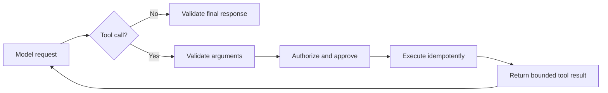

# 5. Structured outputs and tools

Natural language is for people. Schemas and tool calls are for software.

## Structured outputs

Use a schema when downstream code needs fields, enums, arrays, identifiers, or decisions. A valid schema does not guarantee a correct answer, but it removes an entire class of parsing failures.

Design schemas that:

- Use explicit field types and enums
- Distinguish required, optional, and nullable values
- Reject unexpected fields
- Represent uncertainty instead of forcing guesses
- Carry source/evidence identifiers when grounding matters
- Stay small enough to understand and test

Validation layers:

1. **Syntactic:** output parses and matches schema.
2. **Semantic:** dates, IDs, ranges, and cross-field relationships are valid.
3. **Authorization:** the caller may perform the represented action.
4. **Business:** the action complies with domain policy.
5. **Evidence:** important claims are supported by trusted inputs.

## Tool design

A tool is an application capability offered to a model. Good tools resemble well-designed APIs.

Each description should state:

- What the tool does
- When it should and should not be used
- Required arguments and formats
- Side effects
- Whether retrying is safe
- Common errors and their meaning
- Relevant authorization boundaries

Prefer task-level tools such as `schedule_refund(order_id, reason)` over raw capabilities such as `execute_sql(query)`.

## The tool loop

The host application—not the model—must validate, authorize, execute, and log the call.

## Side-effect classes

| Class | Example | Default control |
|---|---|---|
| Read-only | Search product documentation | Automatic within scope |
| Reversible write | Create a draft ticket | Log and allow undo |
| External write | Send an email | Preview and user approval |
| Financial/destructive | Issue refund, delete data | Strong authorization and explicit confirmation |

Do not infer broad authorization from a request to analyze, explain, or plan.

## Reliability controls

- Maximum tool calls and wall-clock deadline
- Per-tool timeout
- Bounded retry count
- Idempotency keys for writes
- Deduplication of repeated calls
- Result-size limits and pagination
- Circuit breakers for failing dependencies
- Explicit terminal states: success, partial, blocked, failed
- Durable state for long-running operations

## Untrusted tool output

Search results, webpages, emails, tickets, and database text may contain prompt injection. Tool results are evidence, not instructions. Tag sources, preserve provenance, filter secrets, and never let returned text increase permissions.

## Current OpenAI implementation notes

The Responses API supports built-in tools, MCP tools, and custom function calls, along with controls such as tool choice, parallel calls, and maximum tool calls. Use current [Responses API guidance](https://developers.openai.com/api/docs/guides/migrate-to-responses) before implementing because capabilities evolve.

## Exercises

1. Define a strict schema for a support ticket containing nullable evidence fields.
2. Build a read-only lookup tool with argument and result validation.
3. Add an idempotent write tool and prove duplicate calls do not duplicate the action.
4. Simulate malformed, oversized, slow, and malicious tool responses.
5. Add a human-approval preview for a consequential action.

## Mastery check

You can:

- Explain why schema validity differs from semantic correctness
- Design narrow tools with clear side effects
- Prevent retries from duplicating writes
- Treat tool output as untrusted data
- Trace and replay a complete tool interaction
