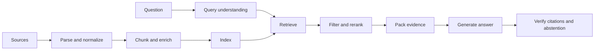

# 6. Retrieval and RAG

Retrieval-augmented generation (RAG) gives a model relevant evidence at request time. It is primarily a search and data-quality system, not a prompt trick.

## The pipeline

Each arrow can fail and needs separate evaluation.

## Ingestion

Preserve:

- Stable document and chunk IDs
- Source URL or record identifier
- Title, author/owner, timestamp, version, and permissions
- Structural location such as heading, page, or section
- Raw content or a recoverable pointer
- Content hash for deduplication and updates

Parsing quality limits everything downstream. Inspect tables, lists, code, headers, footnotes, and scanned text.

## Chunking

Chunk boundaries should follow meaning and retrieval needs.

Strategies:

- Fixed token windows with overlap: simple baseline
- Structure-aware splitting: headings, paragraphs, code symbols
- Semantic splitting: boundaries based on topic changes
- Parent-child retrieval: search small chunks, return larger context
- Entity-centric records: useful for policies, products, or people

Evaluate chunking rather than choosing it from intuition.

## Retrieval

- **Sparse retrieval:** keyword-sensitive, interpretable, strong for exact terms and IDs
- **Dense retrieval:** semantic similarity, strong for paraphrases
- **Hybrid retrieval:** combines sparse and dense signals
- **Metadata filtering:** limits candidates by tenant, time, product, language, or permission
- **Reranking:** applies a more expensive relevance model to a small candidate set

Always apply authorization filtering before content reaches the model.

## Query handling

Some questions benefit from:

- Normalization and spelling correction
- Metadata extraction
- Query rewriting
- Decomposition into subquestions
- Multiple retrieval queries

Do not rewrite away identifiers, quoted phrases, negation, or the user's actual intent.

## Evidence packing

Provide a small, diverse, high-quality set with:

- Clear delimiters
- Stable source labels
- Enough surrounding context to interpret the excerpt
- Ordering by relevance and authority
- Instructions to cite evidence and abstain when insufficient

Avoid filling the context window simply because space exists.

## Evaluation

Separate retrieval from generation.

### Retrieval metrics

- Recall@k of supporting evidence
- Precision@k or judged relevance
- Rank of the first useful chunk
- Permission-filter correctness

### Answer metrics

- Correctness and completeness
- Citation entailment: does the cited source support the claim?
- Citation completeness: are important claims cited?
- Abstention quality for unanswerable questions
- Robustness to conflicting or stale sources

If retrieval recall is poor, prompt changes cannot recover missing evidence.

## Common failures

- Scanned or malformed source never parsed
- Chunk omits the qualifier that reverses meaning
- Similar but wrong product/version ranks highly
- Old policy outranks current policy
- Cross-tenant document leaks into candidates
- Answer cites a source that mentions the topic but does not support the claim
- Model answers from prior knowledge when the corpus is silent

## Exercises

1. Create 50 questions with known supporting chunks and calculate recall@k.
2. Compare fixed, structure-aware, and parent-child chunking.
3. Compare sparse, dense, and hybrid retrieval on identifiers and paraphrases.
4. Add conflicting old/new documents and enforce authority plus recency.
5. Add unanswerable questions and tune abstention behavior.

## Mastery check

You can diagnose whether a bad answer came from ingestion, chunking, retrieval, ranking, context packing, or generation.
