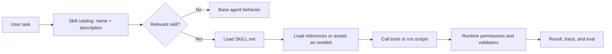

# 7A. Agent skills and extension architecture

An Agent Skill turns a useful prompt or playbook into a portable, version-controlled package that an agent can load when relevant. It changes the agent's context and available procedure; it does not train the model or modify its weights.

The format originated at Anthropic and is now an open standard. A compatible client first sees a skill's name and description, loads `SKILL.md` when the task matches, then reads references or runs scripts only when needed. This is called progressive disclosure. See the [Agent Skills overview](https://agentskills.io/home) and [format specification](https://agentskills.io/specification).

## The mental model



The `description` is a router, not marketing copy. It must state both what the skill does and the tasks that should activate it. The body supplies the procedure after activation.

## Portable structure

```text
skill-name/
├── SKILL.md          # required metadata and procedure
├── scripts/          # optional deterministic operations
├── references/       # optional knowledge loaded on demand
├── assets/           # optional templates and output resources
└── agents/           # optional client-specific metadata
```

A minimal portable `SKILL.md` looks like this:

```markdown
---
name: review-rag-system
description: Review a RAG architecture for retrieval quality, grounding, security, evaluation, latency, and cost. Use when assessing a RAG proposal, diagram, implementation, or production incident.
---

# Review a RAG system

1. Define the user outcome and answer-quality metric.
2. Trace ingestion, retrieval, evidence packing, generation, and citation validation.
3. Separate retrieval failures from generation failures.
4. Rank findings and attach an acceptance test to every recommendation.
```

The standard requires `name` and `description`. Keep the main file concise, place conditional detail in focused reference files, and use scripts when the same deterministic logic would otherwise be regenerated on every run. The specification recommends keeping `SKILL.md` under 500 lines and 5,000 tokens.

This repository includes a working example at [`.agents/skills/review-ai-system-design/`](../.agents/skills/review-ai-system-design/SKILL.md).

## How Claude Code creates and uses a skill

Claude does not perform a special training step. You or Claude create normal files:

1. Choose a project or personal scope.
2. Create the skill directory and `SKILL.md`.
3. Write a precise trigger description and a reusable procedure.
4. Add references, scripts, or templates only when they reduce repetition or improve reliability.
5. Invoke realistic positive and negative prompts, inspect the trace, and revise the skill.

Claude Code discovers personal skills at `~/.claude/skills/<name>/SKILL.md` and project skills at `.claude/skills/<name>/SKILL.md`. It can activate a skill from the description or run it explicitly as `/<name>`. Claude-specific frontmatter can restrict automatic invocation, grant a limited tool set, or run the skill in a forked subagent context. Those extensions are useful, but they are not all portable. Check the current [Claude Code skills documentation](https://code.claude.com/docs/en/skills).

For a cross-client skill, keep the core procedure standard-compliant and isolate product-specific behavior in a thin wrapper or metadata file.

## Different clients and frameworks

| Environment | Typical project location | Relationship to skills |
|---|---|---|
| Claude Code | `.claude/skills/<name>/SKILL.md` | Open format plus Claude-specific invocation, permission, hook, and subagent options |
| OpenAI Codex | `.agents/skills/<name>/SKILL.md` | Open format; Codex scans repository, user, admin, and bundled skill locations |
| VS Code with GitHub Copilot | `.agents/skills/<name>/SKILL.md` | Uses the open folder format in the Agent Skills quickstart |
| Custom agent or orchestration framework | Application-defined | Native support varies; implement a catalog, router, loader, resource access, and execution policy |

Codex also uses progressive disclosure: it starts with the name and description and loads the full instructions when the skill is selected. See [Build skills in Codex](https://learn.chatgpt.com/docs/build-skills) and the cross-client [Agent Skills quickstart](https://agentskills.io/skill-creation/quickstart).

LangGraph, the OpenAI Agents SDK, CrewAI, AutoGen, and similar libraries are orchestration runtimes. A runtime is not automatically a skill system. It can adopt the standard through the same integration contract:

```text
discover folders -> validate metadata -> expose catalog -> select skill
-> load instructions -> grant approved resources/tools -> execute -> evaluate
```

Learn this contract before learning framework syntax. Then a framework becomes a replaceable implementation choice instead of the center of your architecture.

## Skills versus the surrounding layers

| Mechanism | Use it for | Do not mistake it for |
|---|---|---|
| `CLAUDE.md` or `AGENTS.md` | Small, always-on project conventions | A large reference manual |
| Skill | On-demand knowledge or a repeatable workflow | Permanent learning or hard enforcement |
| Tool or MCP server | Reading data or taking an external action | Instructions for using the capability well |
| Hook, permission, validator, or sandbox | Enforcing a boundary deterministically | A suggestion written in a prompt |
| Subagent | Isolated context or genuinely parallel work | A reusable procedure |
| Plugin | Packaging and distributing skills, tools, hooks, or metadata | The skill itself |
| Eval | Measuring whether selection and execution work | A one-time demo |

A skill can tell an agent never to expose secrets, but that instruction is a soft control. Secret isolation, authorization, allowlists, sandboxes, hooks, and output validation enforce the boundary. Claude's own extension guide makes the same distinction: prompt instructions request behavior; runtime hooks can enforce it. See [Claude Code extension architecture](https://code.claude.com/docs/en/features-overview).

## System design for a reliable skill platform

Use five separable layers:

1. **Registry:** discover and version skills; validate names, descriptions, and files.
2. **Router:** match tasks to candidate skills; allow explicit selection and log the reason.
3. **Context loader:** inject only the chosen procedure and conditionally needed references.
4. **Execution boundary:** expose least-privileged tools, sandbox scripts, require approval for consequential actions, and validate outputs.
5. **Evaluation loop:** test activation, task quality, safety, latency, and cost; turn failures into regression cases.

Do not make skill selection the only safety decision. Selection answers “which procedure is useful?” Authorization answers “which action is allowed?” Keep those decisions separate.

## How to write a strong skill

- Start from a real completed task, correction, runbook, or failure—not generic generated advice.
- Define one coherent capability, like a well-designed function.
- Put all activation clues in `description` because the body is not loaded until after selection.
- Use imperative steps, a default approach, concrete gotchas, an output template, and a validation loop.
- Put detailed variants in one-level-deep reference files and say exactly when to read each one.
- Bundle tested scripts for fragile or repeatedly regenerated logic.
- Treat third-party skills as executable supply-chain inputs: review instructions, scripts, dependencies, permissions, and network behavior.

These practices follow the open standard's [skill-creator guidance](https://agentskills.io/skill-creation/best-practices).

## Evaluate the skill as a system

Build a small test set with:

- Positive prompts that should activate the skill
- Paraphrased and indirect positive prompts
- Near-neighbor prompts that should not activate it
- Adversarial content inside documents or tool output
- Tasks with missing information, dependency failures, and permission denial

Measure activation precision and recall separately from task quality. Then compare task success with and without the skill. A skill that activates perfectly but does not improve results is just context overhead.

## Learning order

1. Create one instruction-only skill for a workflow you already understand.
2. Test ten positive and ten negative activation prompts.
3. Move conditional details into `references/`.
4. Add one deterministic validator or parser in `scripts/` when repetition justifies it.
5. Connect one least-privileged tool or MCP capability.
6. Add runtime guardrails and a human approval boundary.
7. Run the same core skill in Claude Code and Codex; document incompatible extensions.
8. Integrate the loader contract into one orchestration framework.

## Exercises

1. Copy the example skill into `.claude/skills/`, invoke it in Claude Code, and compare the result with Codex.
2. Write five prompts that should trigger it and five similar prompts that should not.
3. Add one project-specific gotcha, then demonstrate a failure before the change and a passing regression case after it.
4. Replace one prompt-only safety instruction with a deterministic runtime control.
5. Implement a minimal skill catalog and loader in plain Python before using an orchestration framework.

## Mastery check

You can explain why a skill activated, show that it improves measured task performance, port its core procedure between two compatible clients, and identify which controls must remain outside the model.

